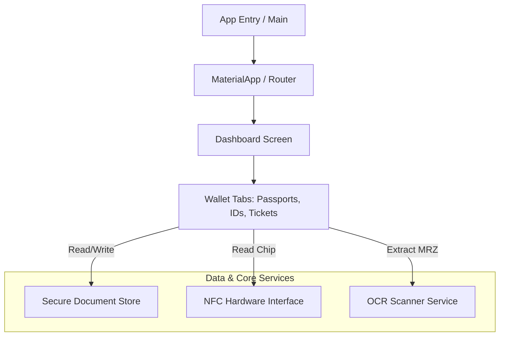

# Docket 📇 (SlickPort)

A premium, high-fidelity digital wallet application for iOS and Android built with Flutter. **Docket** serves as a secure, local-first repository for your physical passports, national ID cards, and ticketing passes. It features dynamic interactive UI designs, offline OCR document extraction, and secure hardware-level NFC chip communication.

Developed with Clean Architecture principles, Docket delivers native-grade performance with custom 3D card tilt gestures, responsive shine effects, custom audio triggers, and tactile haptic feedback.

---

## 🚀 Key Features

*   **Interactive 3D Document Cards**: Fully-customized cards simulating official booklets (such as the Indian Passport, Aadhaar ID, and transit tickets) with single-tap flip gestures, interactive drag-tilt reactions, custom-drawn holographic security lines, and reflective overlays.
*   **Secure NFC Passport Verification**: Direct hardware integration invoking local host APIs to read and decrypt international biometric passport chips (supporting Basic Access Control - BAC, and PACE) using MethodChannels to extract personal records and raw chip portraits directly from Data Group 1 (`DG1`) and Data Group 2 (`DG2`).
*   **Offline OCR Document Scanning**: Real-time scanner processing powered by Google ML Kit to read and parse Machine Readable Zones (MRZ) on passports and scan QR codes or texts on identity documents completely offline.
*   **Robust Multi-Document Wallet**: Categorized dashboard layout supporting passport records, national IDs, and entertainment/travel tickets with drag-and-drop ordering, archive/trash capabilities, and search.
*   **Immersive Sensory Design**: Integrated tactile touch events using a dedicated haptics configuration and custom sound design triggers synchronized with user actions.
*   **Secure Local Storage**: Hardware-level encryption powered by secure preferences storing credentials with zero remote telemetry.

---

## 🛠️ Technology Stack

*   **Framework**: [Flutter](https://flutter.dev) (Dart SDK `^3.11.5`)
*   **State Management**: [Riverpod](https://pub.dev/packages/flutter_riverpod) (`^2.6.1`) for reactive data bindings
*   **Animation System**: Custom motion curves ([EntryReveal](file:///D:/dev/projects/passport_app/lib/core/motion/entry_reveal.dart)) and [Flutter Animate](https://pub.dev/packages/flutter_animate)
*   **Local Storage**: [Flutter Secure Storage](https://pub.dev/packages/flutter_secure_storage) with `encryptedSharedPreferences` enabled on Android and Keychain on iOS
*   **OCR & Scanning**: [Google ML Kit Text Recognition](https://pub.dev/packages/google_mlkit_text_recognition), [Barcode Scanning](https://pub.dev/packages/google_mlkit_barcode_scanning), and [Face Detection](https://pub.dev/packages/google_mlkit_face_detection)
*   **Typography**: Inter and Outfit families fetched dynamically via [Google Fonts](https://pub.dev/packages/google_fonts) with fallback safety for offline setups
*   **Platform Integrations**: MethodChannel interfaces mapped to native Android/iOS SDK libraries (such as JMRTD for biometric document parsing)

---

## 📂 Architecture Tour

Docket strictly implements a **Clean Architecture** framework, cleanly partitioning features into three domains:
*   **Presentation Layer**: Direct UI representation, custom canvas graphics, and interactive touch listeners.
*   **Domain Layer**: Pure business logic models and validation rules.
*   **Data/Application Layer**: State synchronization controllers, OCR processing engines, and local persistence.



### Key Modules & Directories:

*   📂 **[`lib/core/`](file:///D:/dev/projects/passport_app/lib/core)**: Global utilities, layout definitions, and shared resources.
    *   [haptics/](file:///D:/dev/projects/passport_app/lib/core/haptics): Wraps system-wide tactile vibration setups.
    *   [sound/](file:///D:/dev/projects/passport_app/lib/core/sound): Manages short audio playback triggers.
    *   [storage/](file:///D:/dev/projects/passport_app/lib/core/storage): [SecureDocumentStore](file:///D:/dev/projects/passport_app/lib/core/storage/secure_document_store.dart) for AES-256 local document storage.
    *   [motion/](file:///D:/dev/projects/passport_app/lib/core/motion): Custom curve interpolations like `_EaseOutQuint` and `EntryReveal` screen entrances.
    *   [theme/](file:///D:/dev/projects/passport_app/lib/core/theme): Custom layout tokens, color schemes, and dark/light configuration.
*   📂 **[`lib/features/`](file:///D:/dev/projects/passport_app/lib/features)**: Functional vertical slices of features.
    *   [dashboard/](file:///D:/dev/projects/passport_app/lib/features/dashboard): Wallet list interfaces, filters, drag-to-reorder layout controller, and application settings.
    *   [passport/](file:///D:/dev/projects/passport_app/lib/features/passport): Domain models representing passport profiles and forms.
    *   [nfc/](file:///D:/dev/projects/passport_app/lib/features/nfc): Host communication for read requests.
    *   [mrz_scanner/](file:///D:/dev/projects/passport_app/lib/features/mrz_scanner): Custom camera overlays and ML Kit text processors.
    *   [ids/](file:///D:/dev/projects/passport_app/lib/features/ids): Identification form validator schemas and scanner components.
    *   [tickets/](file:///D:/dev/projects/passport_app/lib/features/tickets): Transit and event card formats.
    *   [onboarding/](file:///D:/dev/projects/passport_app/lib/features/onboarding): Welcome wizard screens for first-time application configuration.
*   📂 **[`lib/shared/`](file:///D:/dev/projects/passport_app/lib/shared)**: Modular custom UI components.
    *   [widgets/](file:///D:/dev/projects/passport_app/lib/shared/widgets): Core styling blocks, including 3D card shine borders, custom bottom sheets, and capture buttons.

---

## 🛠️ Getting Started & Installation

### Prerequisites

1.  **Flutter SDK**: Installed and configured on your path.
    ```bash
    flutter --version # Target >= 3.11.5
    ```
2.  **Target Platform SDKs**:
    *   **Android**: Android SDK supporting API Level 26 (Oreo) or higher. NFC hardware is required for chip reading.
    *   **iOS**: CocoaPods installed, targeting iOS 13.0 or higher. Apple Developer Account configured for NFC Capability (if deploying on a physical device).

### Quick Setup

1.  Clone the repository and navigate to the project directory:
    ```bash
    cd passport_app
    ```
2.  Install dependencies:
    ```bash
    flutter pub get
    ```
3.  Check platform-specific setup and device connections:
    ```bash
    flutter doctor
    ```
4.  Run the application in developer mode:
    ```bash
    flutter run
    ```

---

## 🔒 Security & Privacy Guidelines

*   **No Cloud Storage**: All records, OCR captures, and NFC biometric outputs remain within the secure enclave of the local device.
*   **Encrypted Preferences**: Personal details stored in [SecureDocumentStore](file:///D:/dev/projects/passport_app/lib/core/storage/secure_document_store.dart) are written directly to encrypted partitions.
*   **Sanitized Telemetry**: Emojis are strictly banned from system logs. Zero user credentials or identity records are compiled in execution traces or console streams.
*   **Cryptographic BAC Generation**: Access to biometric microchips requires the exact document number, birthdate, and expiration date to initialize the session key (BAC) local to the device's chip interface.

---

## 📝 Coding Standards

To maintain production-grade performance and Clean Architecture boundaries:
*   Ensure UI widgets stay small, modular, and use `const` constructor instances where possible.
*   Keep business logic isolated in Riverpod StateNotifiers; the UI layer should only observe state.
*   Avoid generating or printing emojis inside application source code, exceptions, or console logs.
*   Use local isolates or background threads when parsing large image buffers or complex payloads to avoid UI stutter.
